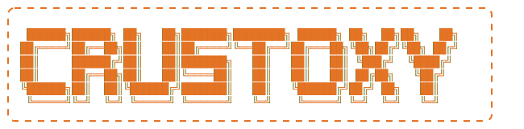

<h1 align="center">🦀 Crustoxy - Route Claude Code to Any OpenAI-Compatible LLM</h1>

<div align="center">
    <a href="https://sonarcloud.io/summary/new_code?id=omidiyanto_crustoxy">
        
    </a>
    <br><br>
    <a href="https://github.com/omidiyanto/crustoxy/actions/workflows/ci.yaml">
        
    </a>
    <a href="https://github.com/omidiyanto/crustoxy/releases">
        
    </a>
    <br><br>
    
    
    
    
</div>
<br>

<div align="center">
    
    <h3 align="center"><i>A blazing fast and secure single-binary Rust proxy <br> empowering <a href="https://docs.anthropic.com/en/docs/agents-and-tools/claude-code/overview">Claude Code</a> with unlimited LLM models flexibility.</i></h3>
</div>

## **🤔 Why was Crustoxy created?**  
This project was built to unleash the extraordinary potential of *Claude Code*. Claude Code transcends traditional CLI coding agents due to its software architecture, which is designed as an enterprise-grade autonomous agent ecosystem rather than a simple terminal interface wrapper. Its core strength lies in agentic workflows that embed seamlessly into your local environment—capable of autonomously mapping repositories, executing terminal commands, running comprehensive test suites, and performing self-healing on errors. These functions are entirely driven by a proprietary system prompt meticulously crafted for context management optimization without demanding manual configuration.

Furthermore, this tool is fortified by a robust plugin ecosystem enabling smooth integration with various third-party services. It comes wrapped in enterprise-grade security and governance features such as anti-destructive guardrails, strict access management, and high-level privacy standards. This makes it an instant, secure, and infinitely more comprehensive plug-and-play solution for industrial scale when compared to rigid open-source alternatives.

Through **Crustoxy**, this proxy bridges Claude Code's capabilities to freely interact with 24+ different LLM providers (such as OpenAI, OpenRouter, Groq, DeepSeek, Google Gemini, Ollama, etc.), liberating it from the exclusivity constraints of the Anthropic API.

## 🎯 Core Features

- **Blazing Fast & Lightweight**: Written in pure Rust using `axum`, boasting near-zero proxy latency and an extremely minimal memory footprint perfect for long-running daemonized processes.
- **Anthropic ↔ OpenAI Compat API**: Automatically translates Anthropic's complex proprietary API requests (such as `messages`, `system`, `tools`, `thinking`) into standard, universally accepted OpenAI-compatible API requests. It then seamlessly streams the responses back using Anthropic's exact SSE (Server-Sent Events) formatting and event sequences.
- **Out-of-the-box 24+ Provider Support**: Natively integrates with 24 major LLM platforms (OpenRouter, DeepSeek, Groq, Ollama, etc.) by automatically defining base URLs and mapping provider-specific quirks, driven directly by your simple `.env` configuration.
- **Smart 429 Rate Limit Deflection**:
  - Proactive algorithmic sliding window rate limiter that intelligently throttles concurrent bursts *before* provider limits are hit.
  - Reactive blocking with customizable exponential backoff and jitter retries when an HTTP `429` is eventually encountered.
- **Native Windsurf Integration (Embedded)**: Instead of routing through an external Windsurf proxy, Crustoxy natively spawns and communicates directly with the Windsurf language server binary via gRPC over HTTP/2 cleartext (h2c). Supports both the Cascade flow (modern models) and RawGetChatMessage (legacy models) with automatic model resolution and streaming SSE output. Disabled by default; activates automatically when `WINDSURF_API_KEY` is set.
- **RTK Token Optimization (System Prompt Compact)**: Automatically compacts Claude Code's notoriously large system prompts (often 4,000+ tokens) into a concise, factual RTK-style format (as low as 200–300 tokens) by extracting essential metadata (workspace, platform, OS) and discarding boilerplate. Saves significant token budget on every turn. Optional full override via `OVERRIDE_SYSTEM_PROMPT`.
- **Automated IP Rotation (Anti-WAF Shield)**: Actively communicates with a localized `warp-svc` daemon to automatically trigger `warp-cli` disconnection and registration renewal sequences, rotating your public Cloudflare WARP IPv4/IPv6 if all passive rate-limit retries fail to bypass IP-based blocks.
- **Zero-Latency Agentic Mocking**: Intercepts expensive internal Claude Code workspace telemetry calls (such as Quota probing, conversation title generation, and OS filepath constraint extraction) and mocks the responses instantly on the edge, bypassing wasteful API roundtrips and heavily saving token costs.
- **Advanced Think & Thought Tag Extraction**: Stateful stream parsing that intercepts inline deep-reasoning tags (`<think>...` or `<thought>...`) emitted by Open-Weights models on-the-fly, safely relocating their contents into pure, native Anthropic `thinking` blocks without interrupting the main text stream.
- **Heuristic Tool Parser Fallback**: A two-tiered safety net that statically heals structurally malformed/garbled JSON tool schemas, and dynamically detects raw text tool calls (e.g., `<function=Name><parameter=key>value</parameter>`) natively emitted by Open-Weights models. It parses their geometry on-the-fly and accurately converts them into valid Anthropic structured JSON tool call events.
- **Intelligent Auto-Retry Pipeline**: A self-healing SSE streaming architecture that detects tool-calling intent in plain text responses and automatically triggers an internal corrective retry, keeping the connection open and preventing Claude Code from stalling.
- **Synchronous Non-Streaming Fallback**: Graceful handling of standard `stream: false` requests, securely decoding raw text/tool calls back into Anthropic `MessagesResponse` format.
- **IDE Extension Compatibility**: Plug-and-play compatibility with both the official `Claude Code for VS Code` extension as well as the robust `Google Antigravity` IDE assistant workflow.

---

## 🚀 Quick Start

### 1. Prerequisites (For Native Setup)

Ensure you have **Rust** and **Cargo** installed globally. 
If you plan to use `ENABLE_IP_ROTATION=true` natively (without Docker), you **must** install Cloudflare WARP (`warp-cli`):

**Ubuntu / Debian Installation:**
```bash
# Add cloudflare gpg key
curl -fsSL https://pkg.cloudflareclient.com/pubkey.gpg | sudo gpg --yes --dearmor --output /usr/share/keyrings/cloudflare-warp-archive-keyring.gpg
# Add repo
echo "deb [signed-by=/usr/share/keyrings/cloudflare-warp-archive-keyring.gpg] https://pkg.cloudflareclient.com/ $(lsb_release -cs) main" | sudo tee /etc/apt/sources.list.d/cloudflare-client.list
# Install
sudo apt-get update && sudo apt-get install cloudflare-warp
```

### 2. Clone & Configure
   ```bash
   git clone https://github.com/omidiyanto/crustoxy.git
   cd crustoxy
   cp .env.example .env
   ```
2. **Edit `.env`**
   Add your preferred provider API keys and setup which model you want to default to:
   ```env
   # Set default routing target (use windsurf/ prefix for native Windsurf)
   MODEL=openrouter/meta-llama/llama-3-8b-instruct:free

   OPENROUTER_API_KEY=sk-or-v1-yourapikey
   OLLAMA_BASE_URL=http://localhost:11434/v1

   # Optional: enable native Windsurf integration
   # WINDSURF_API_KEY=ws_xxxxxxxxxxxxxxxx

   # Optional: compact Claude Code system prompts (enabled by default)
   # ENABLE_RTK=true
   # OVERRIDE_SYSTEM_PROMPT=Your custom system prompt here
   ```

3. **Build & Run Locally**
   ```bash
   cargo build --release
   ./target/release/crustoxy
   ```
   *The server will start on `http://127.0.0.1:8082`*.

4. **Connect Claude Code via CLI**
   Set the API URL for your local Claude Code terminal session:
   ```bash
   export ANTHROPIC_AUTH_TOKEN="sk-ant-dummy"
   export ANTHROPIC_BASE_URL="http://127.0.0.1:8082"
   claude
   ```

   **Make it persistent in `~/.bashrc`:**
   To automatically apply these variables every time you open a terminal, append them to your `~/.bashrc` (or `~/.zshrc`):
   ```bash
   echo 'export ANTHROPIC_AUTH_TOKEN="sk-ant-dummy"' >> ~/.bashrc
   echo 'export ANTHROPIC_BASE_URL="http://127.0.0.1:8082"' >> ~/.bashrc
   source ~/.bashrc
   ```

5. **Connect via Claude Code VS Code Extension**
   Crustoxy is fully compatible with the official Claude Code VS Code extension. To configure it via the raw settings file:
   1. Open the Extensions tab in VS Code and search for **Claude Code for VS Code**.
   2. Click the gear (`⚙️`) icon on the extension page and select **Extension Settings**.
   3. Find **Claude Code: Environment Variables** and click the hyperlink **"Edit in settings.json"**.
   4. Map your proxy values by inserting the JSON array like this example:
      ```json
      "claudeCode.environmentVariables": [
          {
              "name": "ANTHROPIC_BASE_URL",
              "value": "http://127.0.0.1:8082"
          },
          {
              "name": "ANTHROPIC_AUTH_TOKEN",
              "value": "sk-ant-dummy"
          }
      ]
      ```
   5. Save the file and restart your IDE for the connection to apply.

---

## 🐳 Docker Deployment

The project includes a `docker-compose.yaml` to spin up the Rust binary on an ultra-slim Debian runtime pre-installed with `warp-cli` for automated IP rotation.

```bash
# 1. Edit .env and tweak docker-compose if necessary
# 2. Start the service
docker-compose up -d --build

# View logs
docker-compose logs -f
```

---

## 🌊 Native Windsurf Provider

Crustoxy embeds the Windsurf language server binary directly — no external proxy required. When `WINDSURF_API_KEY` is set, any request targeting a model prefixed with `windsurf/` (e.g., `windsurf/claude-sonnet-4` or `windsurf/gpt-4o`) is routed natively through gRPC over HTTP/2 cleartext (h2c) to the local language server, which in turn communicates with Windsurf's upstream cloud.

### How it works
1. **Binary spawn** — On startup, Crustoxy spawns the Windsurf language server binary (`language_server_linux_x64`) on a configurable local port (`42100` by default).
2. **gRPC session** — Crustoxy establishes a persistent HTTP/2 cleartext connection (using the `h2` crate) to the local language server.
3. **Protobuf codec** — Request and response bodies are encoded/decoded using a zero-dependency, schema-less protobuf wire format codec (ported from WindsurfAPI).
4. **Cascade vs Raw flows** — Modern Windsurf models (Claude, GPT-4o, Gemini, etc.) use the Cascade flow (`StartCascade → SendUserCascadeMessage → poll trajectory steps`). Legacy/enum-only models fall back to `RawGetChatMessage` streaming.
5. **SSE output** — Regardless of internal flow, responses are always streamed back to Claude Code using standard Anthropic SSE formatting (`message_start`, `content_block_delta`, `message_stop`).

### Quick setup

```bash
# Option A: Direct API key (from ~/.windsurf/auth/user.json)
WINDSURF_API_KEY=ws_xxxxxxxxxxxxxxxx

# Option B: Firebase ID token (auto-exchanged for API key at startup)
CODEIUM_AUTH_TOKEN=eyJhbGciOiJSUzI1Ni...

# Route any model slot to a Windsurf model
MODEL=windsurf/claude-sonnet-4
# or
MODEL_SONNET=windsurf/claude-sonnet-4
MODEL_OPUS=windsurf/claude-opus-4
MODEL_HAIKU=windsurf/claude-haiku-4
```

`CODEIUM_AUTH_TOKEN` is useful when you only have a Firebase ID token from the Windsurf web login flow — Crustoxy automatically exchanges it via `register.windsurf.com` (falling back to `api.codeium.com`) on startup.

### Docker considerations

The official Docker image already downloads and installs the Windsurf language server binary at `/opt/windsurf/language_server_linux_x64`. A named volume `windsurf-data` persists the language server's internal database and session cache across container restarts.

If you prefer to run natively, download the binary manually:
```bash
mkdir -p /opt/windsurf
curl -fL "https://github.com/dwgx/WindsurfAPI/releases/latest/download/language_server_linux_x64" \
     -o /opt/windsurf/language_server_linux_x64
chmod +x /opt/windsurf/language_server_linux_x64
```

### Health check

The `/health` endpoint reports Windsurf status:
```json
{
  "status": "healthy",
  "features": {
    "windsurf": "healthy",
    "rtk": true
  }
}
```
- `disabled` — `WINDSURF_API_KEY` is not set.
- `healthy` — Language server is running and accepting gRPC connections.
- `unhealthy` — Language server process has exited or is not responding.

---

## ⚙️ Configuration Parameters

You can fine-tune Crustoxy to fit your exact infrastructure requirements via the `.env` file. Below are the configurations and what they govern:

### 1. Server Configuration
- `HOST` *(default: `0.0.0.0`)*: The network interface the proxy runs on.
- `PORT` *(default: `8082`)*: The port the proxy listens on.
- `ANTHROPIC_AUTH_TOKEN`: Optional. Defines an arbitrary static Bearer token used to secure Crustoxy. If filled, Claude Code CLI must use the matching value in its `ANTHROPIC_AUTH_TOKEN` environment variable. Leave blank for no auth.

### 2. Model Mapping
Claude Code inherently delegates tasks between `opus`, `sonnet`, and `haiku` models implicitly. Crustoxy redirects these to the models of your choosing:
- `MODEL_OPUS` / `MODEL_SONNET` / `MODEL_HAIKU`: Format using `provider_id/model_id` (e.g., `groq/llama3-8b-8192`).
- `MODEL`: The fallback unified model router if a specific subset isn't defined.

### 3. Rate Limiting & Concurrency
Crustoxy employs algorithmic Sliding Window limits to prevent your account from hitting provider throttles too aggressively.
- `PROVIDER_RATE_LIMIT` *(default: `40`)*: The amount of requests allowed during the window.
- `PROVIDER_RATE_WINDOW` *(default: `60`)*: The timeframe in seconds where the rate limit applies.
- `PROVIDER_MAX_CONCURRENCY` *(default: `5`)*: Hard caps how many simultaneous HTTP requests can be inflight to the provider. Any excess requests will cleanly wait in queue.

### 4. HTTP Settings
- `HTTP_READ_TIMEOUT` *(default: `300`)*: Max time in seconds to keep a stream connection alive while waiting for inference tokens. High values are recommended for deep reasoning models.
- `HTTP_CONNECT_TIMEOUT` *(default: `10`)*: Max time in seconds allowed to establish the initial HTTP handshake with a provider.

### 5. IP Rotation
- `ENABLE_IP_ROTATION` *(default: `true`)*: If set to true, seamlessly communicates with `warp-cli` to switch IP allocations when a provider enforces persistent IP-based `429` blocks. (Requires Cloudflare WARP daemon).

### 6. RTK System Prompt Optimization
- `ENABLE_RTK` *(default: `true`)*: When enabled, Claude Code's massive default system prompt (4,000–8,000 tokens) is automatically compacted into a concise RTK-style factual summary (200–300 tokens). Essential metadata (workspace path, OS platform, OS version) is preserved; repetitive instructional boilerplate is stripped.
- `OVERRIDE_SYSTEM_PROMPT`: Leave blank to use RTK-compacted prompt. Set to any text string to fully replace the system prompt sent to the provider, bypassing both the original and the RTK-compacted version.

### 7. Windsurf Native Integration
- `WINDSURF_API_KEY`: Direct API key for Windsurf (from `~/.windsurf/auth/user.json` or browser DevTools). When set, models prefixed with `windsurf/` are routed directly through the embedded language server instead of OpenAI-compatible providers.
- `CODEIUM_AUTH_TOKEN`: Alternative to `WINDSURF_API_KEY`. A Firebase ID token from the Windsurf web login flow. Crustoxy automatically exchanges it for an API key at startup via `register.windsurf.com` (with fallback to `api.codeium.com`). Only one of `WINDSURF_API_KEY` or `CODEIUM_AUTH_TOKEN` needs to be set.
- `WINDSURF_LS_PATH` *(default: `/opt/windsurf/language_server_linux_x64`)*: Path to the Windsurf language server binary. In the Docker image, this is pre-installed at `/opt/windsurf/language_server_linux_x64`.
- `WINDSURF_LS_PORT` *(default: `42100`)*: Local gRPC port the language server listens on. Must be free inside the container or host.
- `WINDSURF_API_SERVER_URL` *(default: `https://server.self-serve.windsurf.com`)*: The upstream Windsurf cloud API server endpoint.

### 8. Optimizations & Safety Nets
- `ENABLE_NETWORK_PROBE_MOCK` / `ENABLE_TITLE_GENERATION_SKIP` / `ENABLE_SUGGESTION_MODE_SKIP` / `ENABLE_FILEPATH_EXTRACTION_MOCK`: Set to `true` to intercept internal telemetry and UI-aesthetic requests heavily spammed by Claude Code. Crustoxy mocks perfect responses instantly, slashing your API token costs heavily.
- `ENABLE_TOOL_RETRY` *(default: `true`)*: Activates the active Auto-Retry Pipeline. When set to true, if a model writes sentences indicating it wants to use a tool (e.g. "Let me run a command") but fails to actually output the structured tool JSON, Crustoxy will silently push the context back and force the model to retry.
- `TOOL_RETRY_MAX` *(default: `2`)*: The maximum amount of times Crustoxy is allowed to automatically retry the provider per single user prompt.

---

## Supported Built-in Providers

No need to figure out endpoint definitions. Just pop in your `API_KEY` for any of the below.

| Provider | Env Prefix | Built-in Base URL |
| :--- | :--- | :--- |
| **Windsurf (Native gRPC)** | `WINDSURF_API_KEY` | `https://server.self-serve.windsurf.com` (internal LS) |
| **OpenAI** | `OPENAI_API_KEY` | `https://api.openai.com/v1` |
| **OpenRouter** | `OPENROUTER_API_KEY` | `https://openrouter.ai/api/v1` |
| **Groq** | `GROQ_API_KEY` | `https://api.groq.com/openai/v1` |
| **DeepSeek** | `DEEPSEEK_API_KEY` | `https://api.deepseek.com/v1` |
| **Google Gemini** | `GEMINI_API_KEY` | `https://generativelanguage.googleapis.com/v1beta/openai` |
| **Together AI** | `TOGETHER_API_KEY` | `https://api.together.xyz/v1` |
| **Hugging Face** | `HUGGINGFACE_API_KEY` | `https://router.huggingface.co/v1` |
| **Mistral AI** | `MISTRAL_API_KEY` | `https://api.mistral.ai/v1` |
| **Perplexity** | `PERPLEXITY_API_KEY`| `https://api.perplexity.ai` |
| **Fireworks AI** | `FIREWORKS_API_KEY` | `https://api.fireworks.ai/inference/v1` |
| **DeepInfra** | `DEEPINFRA_API_KEY` | `https://api.deepinfra.com/v1/openai` |
| **Ollama** | `OLLAMA_API_KEY` | `http://localhost:11434/v1` |
| *...and 10+ more local/cloud services!* | | |

*If you need to use a custom provider, just prefix it with `CUSTOM` inside `.env`.*

---

## 🔄 WARP IP Rotation Mode

When `ENABLE_IP_ROTATION=true` in `.env`, the router will actively communicate with a local Cloudflare WARP daemon. 
If an API provider throws a `429 Too Many Requests` error and all internal exponential retries fail, it triggers a thread-safe native sequence to:
1. `warp-cli disconnect`
2. `warp-cli registration delete`
3. `warp-cli registration new`
4. `warp-cli connect`

This essentially rotates the outgoing IPv4/IPv6 without breaking the proxy pipeline, seamlessly bypassing IP-based rate limiting configurations set by providers.

> [!WARNING]
> **Limitations:** This IP Rotation **does not guarantee 100% success**. Cloudflare WARP uses a globally shared pool of public IPs. Frequently, these WARP IP ranges are flagged or outright blocked by various Cloud Providers and Web Application Firewalls (WAF) due to suspected *scraping bot* activity.
> 
> **Why is this feature still important?** Even though it isn't a *silver bullet*, this passive IP rotation mechanism fundamentally **extends your Session duration significantly**. Rather than having *Claude Code* permanently halt upon hitting its first *rate limit*, this feature gives the proxy a chance to "breathe" with a refreshed identity. It minimizes downtime during long, automated task executions and saves you from having to manually restart the agent.

---

## 🤝 How To Contribute
We highly encourage contributions to Crustoxy to make the routing more scalable or add optimizations to new providers. Here is how you can contribute:

1. **Fork the Repository**: Start by forking the project on GitHub and cloning it to your local development environment.
2. **Create a Feature Branch**: Branch off from `main` (e.g., `git checkout -b feature/add-new-provider`).
3. **Write Clear Code**: Ensure any new features are thoroughly documented and follow the existing architecture in `src/`.
4. **Run CI/CD Checks Locally**: Before submitting your request, please ensure your changes pass our structural guidelines:
   - Format the code: `cargo fmt`
   - Run the linter: `cargo clippy -- -Dwarnings`
   - Pass existing unit tests: `cargo test`
5. **Submit a Pull Request**: Push your branch to GitHub and open a detailed Pull Request explaining your changes and optimizations.

---
